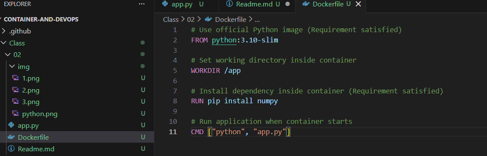
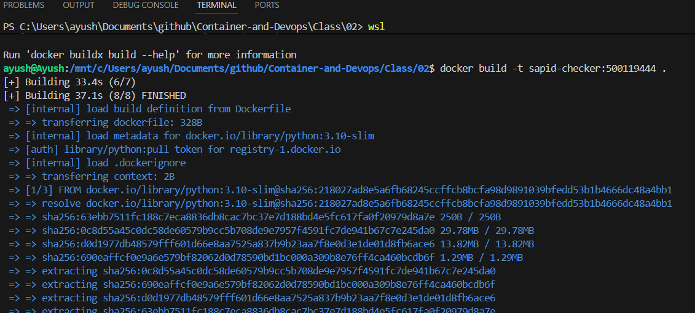
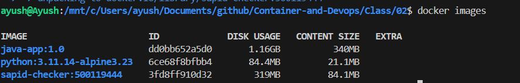

# Making python app image

## Create docker file

1. create separate folder
2. create a python program:


3. create docker file with commands:

```bash
FROM python:3.8-slim

WORKDIR /home/app

COPY app.py .

RUN pip install numpy

CMD [ "python","app.py" ]

```



---

## Build and run image

1. Build the image from the docker file

```bash
docker build -t sapid-checker:500119484 .
```




2. Check Image:

```bash
docker images
```



3. Run the image:

```bash
sudo docker run -it sapid-checker:500119484
```

## Result

Python program running


