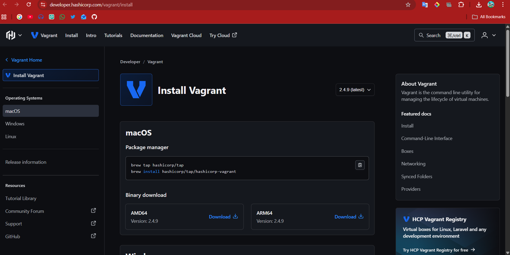
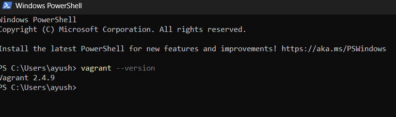
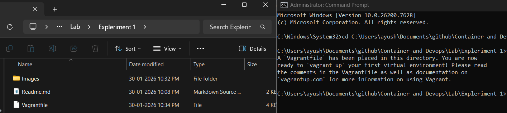
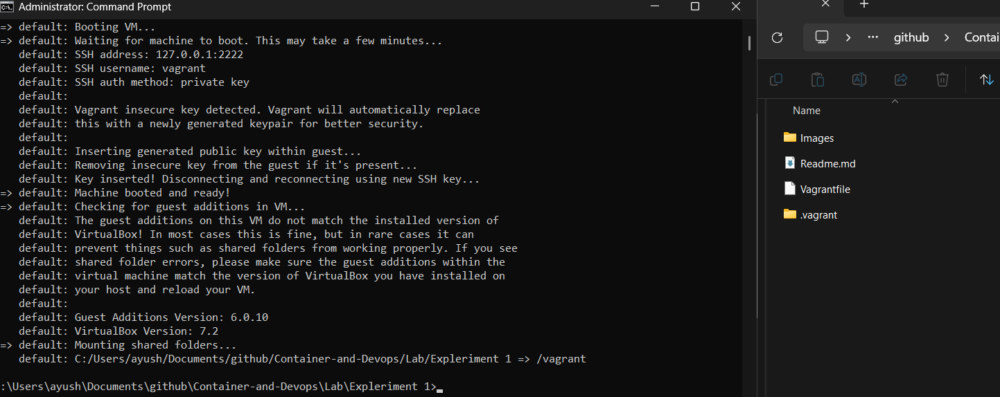
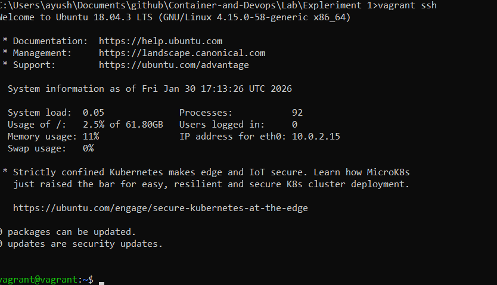
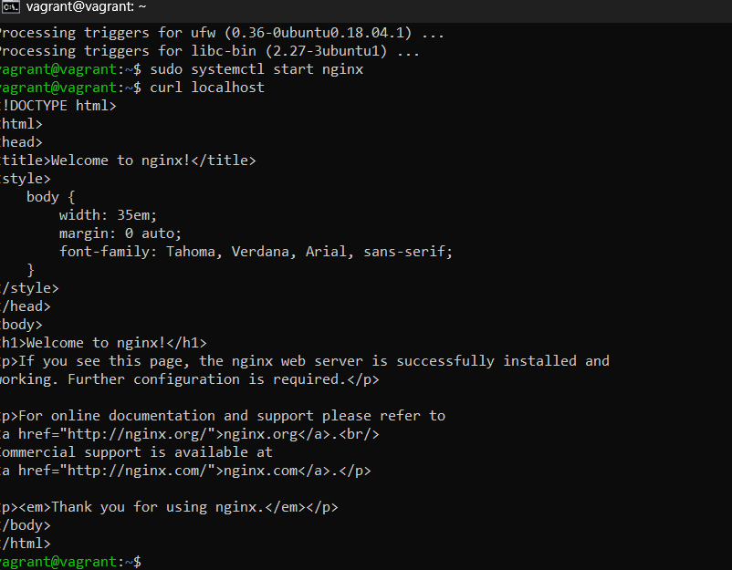
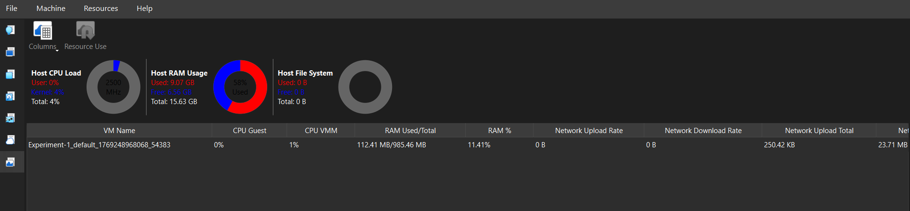
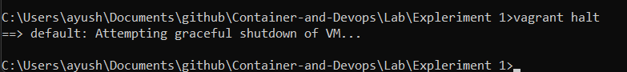
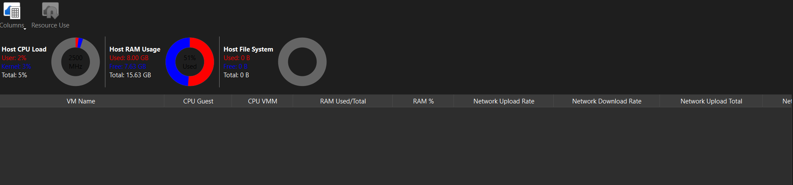
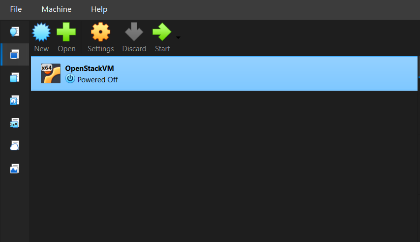

Download Virtual Box from [here](https://www.virtualbox.org/wiki/Downloads)


Download Vagrant from [here](https://developer.hashicorp.com/vagrant/install)



To verify the installation we will check the version via following command
```
vagrant --version
```



Initialize Vagrant with Ubuntu box:
```
vagrant init hashicorp/bionic64
```



Start the VM:
```
vagrant up
```



Access the VM:
```
vagrant ssh
```



Step 4: Install Nginx inside VM
```
sudo apt update
sudo apt install -y nginx
sudo systemctl start nginx
```


Verify Nginx
```
curl localhost
``` 



Utilization Matrix In Running State



Stop VM
```
vagrant halt
```



Utilization Matrix In Stop State



Remove VM
```
vagrant destroy
```



kf
