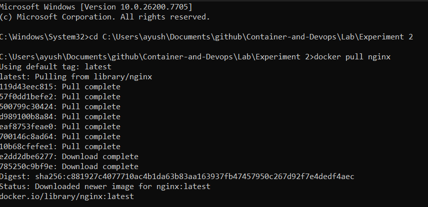
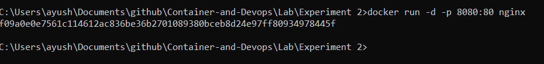
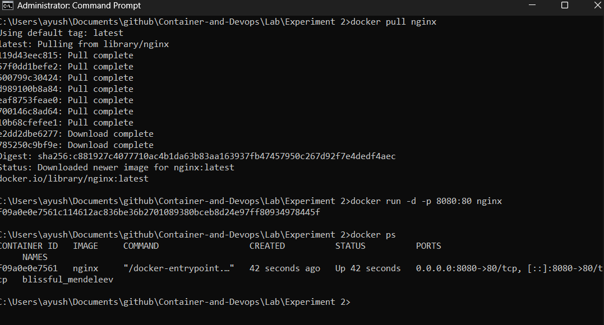
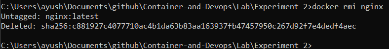

# Objective

Docker Installation, Configuration and Running Images

---

## 1. Pull Docker Images

Pull images from Docker Hub to your local system.
``` bash
docker pull nginx
```

<!-- Image: docker pull command -->
<!-- Place image here -->


---

## 2. Run Containers

Run containers using the pulled Docker images.
``` bash
docker run -d -p 8080:80 nginx
```

<!-- Image: docker run command -->
<!-- Place image here -->


---

## 3. Manage Container Lifecycle

Manage the lifecycle of containers including start, stop, restart, and remove operations.
```bash
docker ps
docker stop <container_id>
docker rm <container_id>
docker rmi nginx
```

<!-- Image: container lifecycle commands -->
<!-- Place image here -->




---

### Notes
- All Docker commands are executed in the system terminal.
- Ensure Docker is installed and running before executing commands.
