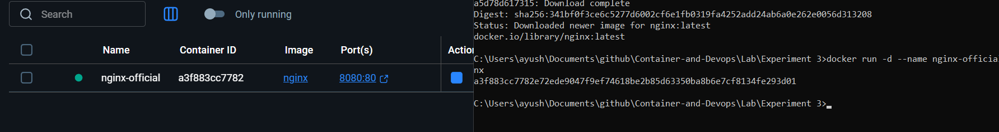
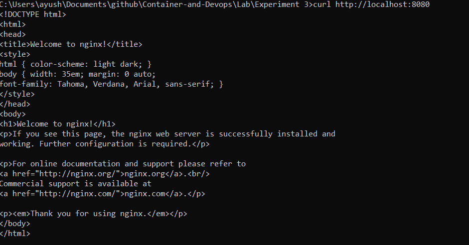
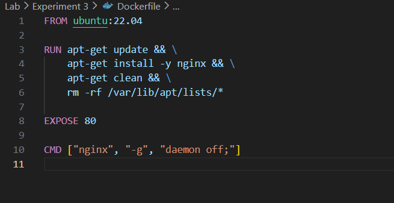
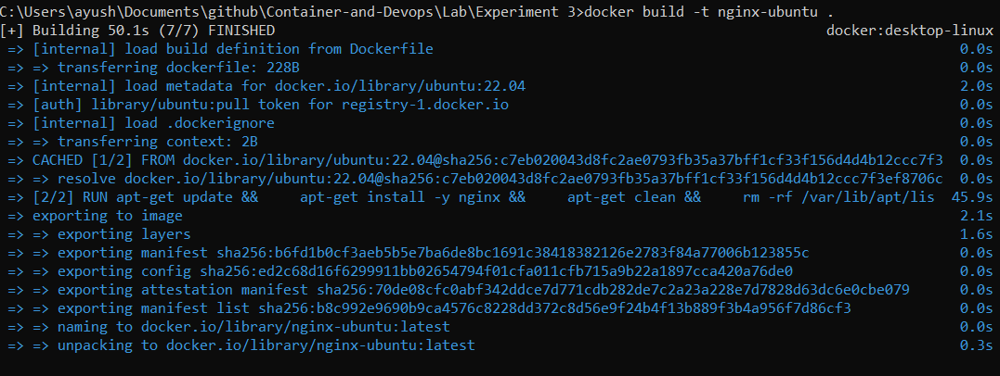
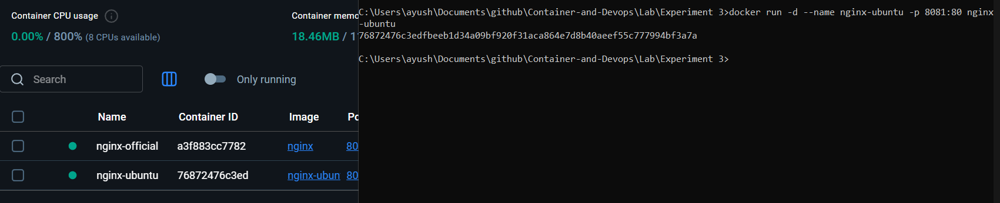
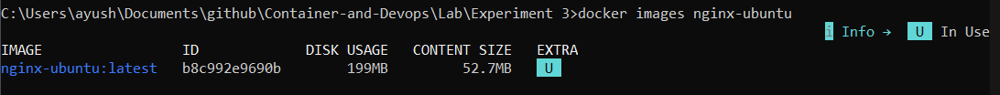
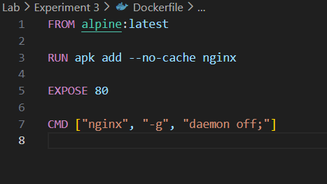
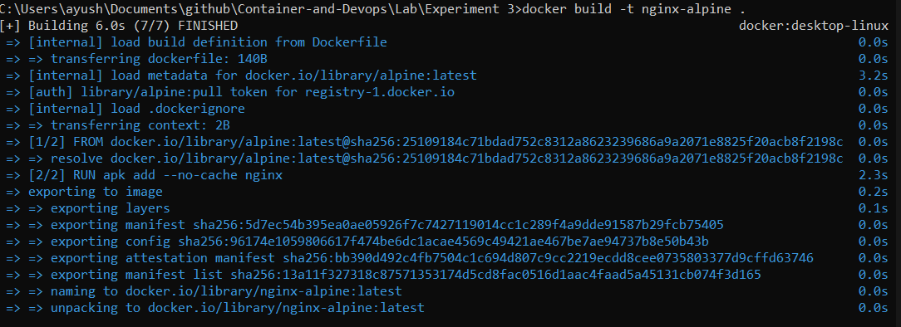
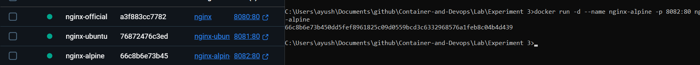
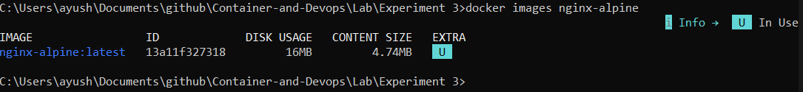

# Experiment 3: NGINX using Docker

## Lab Objectives

After completing this lab, students will be able to:

- Deploy NGINX using:
  - Official `nginx` image
  - Ubuntu-based image
  - Alpine-based image
- Understand Docker image layers and size differences
- Compare performance, security, and use-cases of each approach
- Explain real-world use of NGINX in containerized systems

## Part 1: Deploy NGINX Using Official Image (Recommended Approach)

### Step 1: Pull the Image
```bash
docker pull nginx:latest
```


### Step 2: Run the Container
```bash
docker run -d --name nginx-official -p 8080:80 nginx
```


### Step 3: Verify
```
curl http://localhost:8080
```


### Key Observations
```
docker images nginx
```

- Image is **pre-optimized**
- **Minimal configuration** required
- Uses **Debian-based OS** internally


## Part 2: Custom NGINX Using Ubuntu Base Image

### Step 1: Create Dockerfile

Create a file named `Dockerfile` (no extension) and add the following content:

```dockerfile
FROM ubuntu:22.04

RUN apt-get update && \
    apt-get install -y nginx && \
    apt-get clean && \
    rm -rf /var/lib/apt/lists/*

EXPOSE 80

CMD ["nginx", "-g", "daemon off;"]
```


### Step 2: Build Image
```
docker build -t nginx-ubuntu .
```


### Step 3: Run Container
```
docker run -d \
  --name nginx-ubuntu \
  -p 8081:80 \
  nginx-ubuntu
```


### Observations
```
docker images nginx-ubuntu
```

- Much larger image size
- More layers
- Full OS utilities available


## Part 3: Custom NGINX Using Alpine Base Image

### Step 1: Create Dockerfile

Create a file named `Dockerfile` (no extension) and add the following content:

```
FROM alpine:latest

RUN apk add --no-cache nginx

EXPOSE 80

CMD ["nginx", "-g", "daemon off;"]

```


### Step 2: Build Image
```
docker build -t nginx-alpine

```


### Step 3: Run Container
```
docker run -d --name nginx-alpine -p 8082:80 nginx-alpine
```


### Observations
```
docker images nginx-ubuntu
```

- Extremely small image

- Fewer packages

- Faster pull and startup time


## Part 4: Image Size and Layer Comparison

### Compare Sizes
```
docker images | grep nginx
```


### Inspect Layers
```
docker history nginx
docker history nginx-ubuntu
docker history nginx-alpine
```


### Observations:

- Ubuntu has many filesystem layers
- Alpine has minimal layers
- Official NGINX image is optimized but heavier than Alpine


## Part 5: Functional Tasks Using NGINX
### Task 1: Serve Custom HTML Page
```
mkdir html
echo "<h1>Hello from Docker NGINX</h1>" > html/index.html
```

### Run:
```
docker run -d \
  -p 8083:80 \
  -v $(pwd)/html:/usr/share/nginx/html \
  nginx
```


### Task 2: Reverse Proxy (Conceptual)

### NGINX can:

- Forward traffic to backend services
- Load balance multiple containers
- Terminate SSL

### Example use cases:

- Frontend for microservices
- API gateway
- Static file server

## Part 6: Comparison Summary
### Image Comparison Table

| Feature          | Official NGINX | Ubuntu + NGINX | Alpine + NGINX |
| ---------------- | -------------- | -------------- | -------------- |
| Image Size       | Medium         | Large          | Very Small     |
| Ease of Use      | Very Easy      | Medium         | Medium         |
| Startup Time     | Fast           | Slow           | Very Fast      |
| Debugging Tools  | Limited        | Excellent      | Minimal        |
| Security Surface | Medium         | Large          | Small          |
| Production Ready | Yes            | Rarely         | Yes            |

## Part 7: When to Use What
### Use Official NGINX Image When:

- Production deployment
- Standard web hosting
- Reverse proxy / load balancer

### Use Ubuntu-Based Image When:

- Learning Linux + NGINX internals
- Heavy debugging needed
- Custom system-level dependencies

### Use Alpine-Based Image When:

- Microservices
- CI/CD pipelines
- Cloud and Kubernetes workloads

 
## Expected Learning Outcome

By the end of this lab, students should clearly understand:

- Docker image construction
- Base image impact on size and security
- Why official images exist
- Real-world NGINX usage in container platforms


