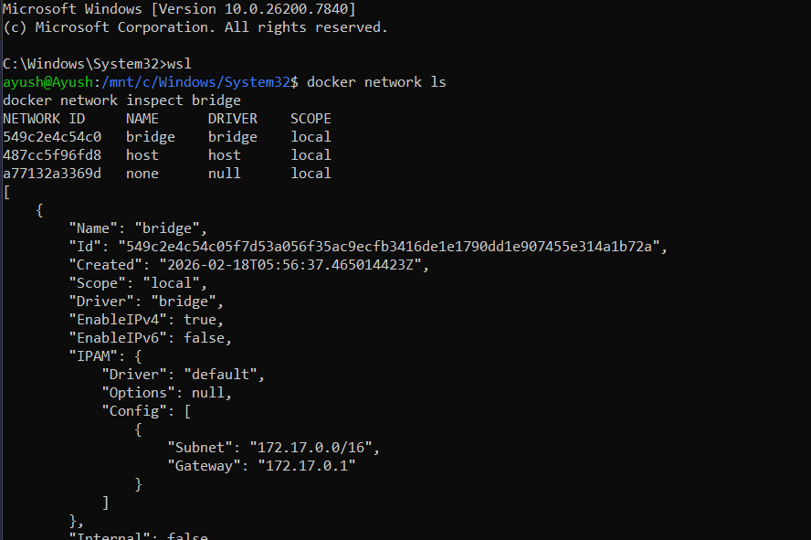
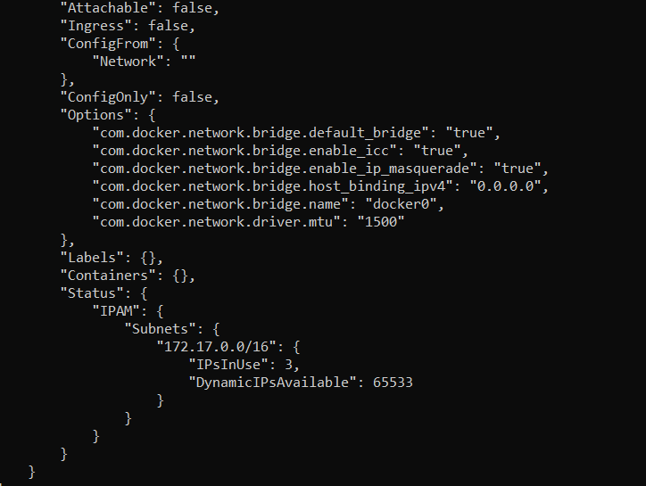
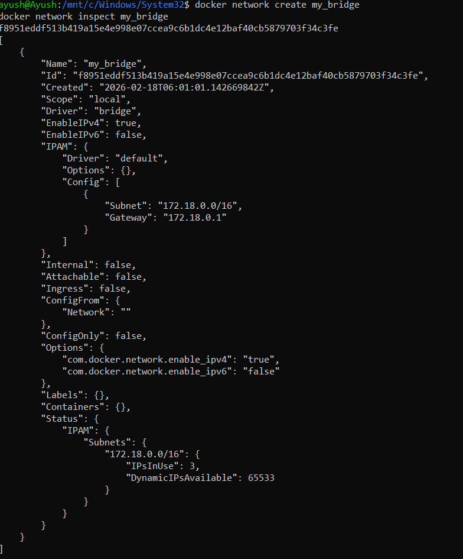
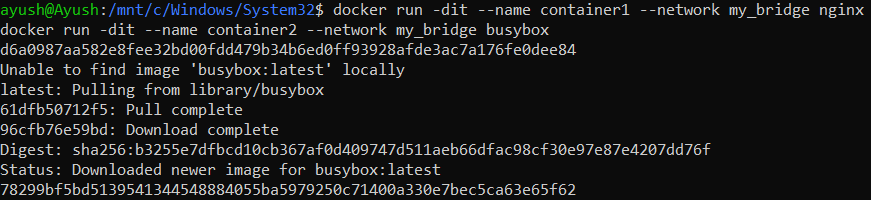
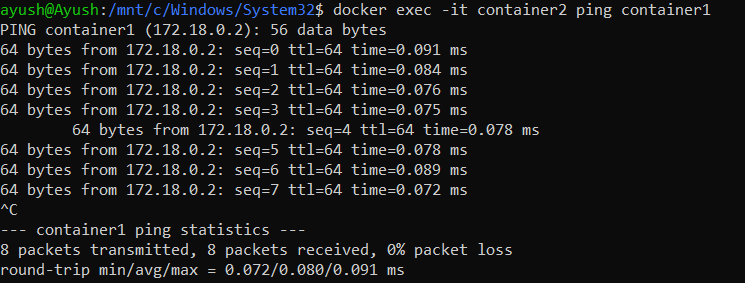
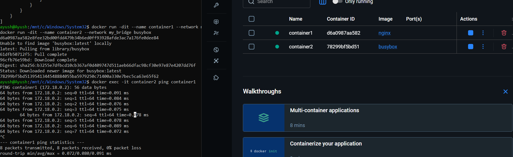
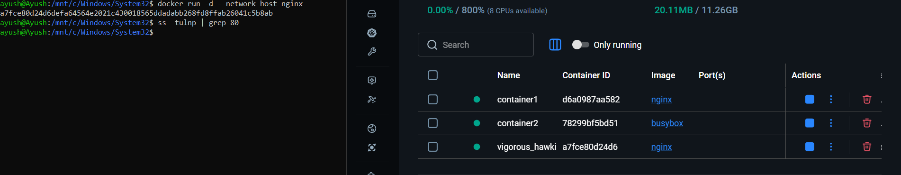

# Docker Bridge Network (The Default)

**Topic:** Understanding and working with Docker Bridge Networks  
**Objective:** Learn how to create, inspect, and manage Docker bridge networks for container communication


## 🌉 What is Bridge?

When you install Docker, it creates a default bridge network called **`docker0`**. Think of it as a virtual switch inside your computer.

### View All Networks

```bash
# See all networks
docker network ls
```

### Output:





**Key Points:**
- `bridge` - Default network for containers
- `host` - Container uses host's network directly
- `none` - No networking for the container
- All have `local` scope (single host only)

---

## Task 1: Inspect the Default Bridge

Examine the default bridge network to understand its configuration.

```bash
# Look at bridge details
docker network inspect bridge
```


### What you'll see:
- **IP range:** (172.17.0.0/16)
- **Gateway:** IP address for the bridge
- **Connected containers:** Any containers currently using this network

**Note:** The default bridge network has limitations - containers can only communicate using IP addresses, not names.

---

## Task 2: Create Your Own Bridge (Better than default)

Create a custom bridge network with automatic DNS resolution.

```bash
# Create custom bridge (like creating your own private network)
docker network create my_app_net

# Verify it exists
docker network ls

# Inspect it
docker network inspect my_app_net
```


### Why custom bridge?

**It gives you automatic DNS (containers can find each other by name).**

**Benefits:**
- ✅ Containers can communicate using container names
- ✅ Better isolation from other containers
- ✅ More control over network configuration
- ✅ Enhanced security

---

## Task 3: Run Containers in Your Network

Launch containers in your custom network and test communication.

```bash
# Run an nginx web server
# -d = detach (run in background)
# --name = give it a name
# --network = which network to use
docker run -d --name web --network my_app_net nginx

# Run a utility container
docker run -d --name utils --network my_app_net alpine sleep 3600

# Test if they can talk (using container names!)
docker exec utils ping web
```



### Magic moment:

**Ping works using container names! Docker runs its own DNS.**

**Explanation:**
- Container `utils` can ping container `web` by name
- No need to know IP addresses
- Docker's built-in DNS automatically resolves container names to IPs
- This only works on custom bridge networks (not the default bridge)


## Task 4: Publish a Port (Make Container Accessible)

Make a container accessible from your host machine by publishing ports.

```bash
# Run nginx and make it available on your computer's port 8080
# -p 8080:80 means "host port 8080 maps to container port 80"
docker run -d --name web-public -p 8080:80 nginx

# Open browser and go to: http://localhost:8080
# You'll see nginx welcome page!

# Check the port mapping
docker port web-public
# Shows: 80/tcp -> 0.0.0.0:8080
```





### Port Mapping Explained:

**`-p 8080:80`**
- `8080` = Port on your computer (host)
- `80` = Port inside the container
- Traffic to `localhost:8080` → forwarded to → container port `80`

**Verification:**
```bash
# From your browser
http://localhost:8080

# From command line
curl http://localhost:8080
```


## 🎓 Bridge Network Cheat Sheet

### Essential Commands

```bash
# List networks
docker network ls

# Create network
docker network create mynet

# Run container in network
docker run -d --network mynet --name myapp nginx

# Connect running container to network
docker network connect mynet mycontainer

# Disconnect container
docker network disconnect mynet mycontainer

# Remove network
docker network rm mynet
```


## 📊 Network Comparison

| Feature | Default Bridge | Custom Bridge | Host | None |
|---------|---------------|---------------|------|------|
| **Container-to-Container** | IP only | Name + IP | Direct | No networking |
| **Isolation** | Moderate | High | None | Complete |
| **DNS Resolution** | ❌ No | ✅ Yes | N/A | N/A |
| **Port Publishing** | ✅ Yes | ✅ Yes | Not needed | N/A |
| **Use Case** | Quick testing | Production apps | Performance critical | Isolated apps |

---

## 🎯 Conclusion

Bridge networks are the foundation of Docker networking. Custom bridge networks provide automatic DNS resolution, making container communication simple and reliable. Understanding bridge networks is essential for building multi-container applications and microservices architectures.

**Remember:** Always use custom bridge networks for production applications to leverage automatic DNS and better isolation!